# DevOps Tech Challenge – Node.js Frontend & Backend on AWS ECS

This repository contains my submission for the DevOps Tech Challenge: a React frontend and Express backend, containerized and deployed to **AWS ECS (Fargate)**, sitting behind an **ALB**, with all application infrastructure — plus the Jenkins host itself — provisioned via **Terraform**. Deployments are automated through a **Jenkins pipeline**, with a GitHub Actions GitOps alternative in `.github/workflows/deploy.yml`.

---

## Live Deployment

| Resource            | URL                                                                     |
| ------------------- | ----------------------------------------------------------------------- |
| Frontend (public)   | <http://node-ecs-app-alb-2131255973.us-east-2.elb.amazonaws.com>        |
| Backend API         | <http://node-ecs-app-alb-2131255973.us-east-2.elb.amazonaws.com/api>    |
| Jenkins server      | <http://3.15.218.209:8080>                                              |
| Jenkins credentials | Provided separately in the submission form (not committed to this repo) |

Verified with a direct request to the backend route through the ALB:

```bash
curl http://node-ecs-app-alb-2131255973.us-east-2.elb.amazonaws.com/api
# {"id":"17bcd47a-309f-404d-bf3a-acf19a613bdd"}
```

---

## Repository Structure

```text
node-ecs-challenge/
├── .github/workflows/
│   └── deploy.yml              # GitOps CD alternative to Jenkins
├── backend/
│   ├── Dockerfile
│   ├── config.js                # CORS / allowed-origin config
│   ├── index.js
│   └── package.json
├── frontend/
│   ├── src/                     # React app
│   ├── nginx.conf                # Serves the built React app in the container
│   ├── Dockerfile
│   └── package.json
├── images/                       # App assets
├── tech_challenge_screenshots/   # Evidence: Jenkins, ECS, ECR, ALB, load test, etc.
├── 00-provider.tf
├── 01-igw.tf
├── 02-subnets.tf
├── 03-route_table.tf
├── 04-vpc.tf
├── 05-alb.tf
├── 06-ec2-jenkins.tf              # Jenkins EC2 instance
├── 07-ecs.tf                      # ECS cluster, task defs, services
├── 08-sg_ecs.tf
├── 09-ecs_auto_scaler.tf           # Target tracking scaling (CPU 50%)
├── 10-ecr.tf                        # ECR repos for frontend/backend
├── 11-iam_ecs.tf                     # ECS task execution/task roles
├── 12-iam_jenkins.tf                  # IAM role for the Jenkins host (ECR/ECS access)
├── 13-sg_jenkins_ec2.tf
├── 14-terraform.tfvars
├── 15-variables.tf
├── A-outputs.tf                        # ALB DNS, ECR URIs, etc.
├── Jenkinsfile
└── README.md
```

Terraform files are numerically prefixed to make the provisioning order and dependency chain easy to follow at a glance (networking → security groups → compute → ECS → auto scaling → outputs).

---

## Architecture Overview

```text
                              Internet
                                 │
                        ┌────────▼────────┐
                        │       ALB        │  (05-alb.tf)
                        └────────┬────────┘
                                 │
           ┌─────────────────────┴─────────────────────┐
           │                                            │
 ┌─────────▼─────────┐                        ┌─────────▼─────────┐
 │  ECS Service:       │   ──calls backend──▶  │  ECS Service:       │
 │  frontend            │                        │  backend             │
 │  (Fargate)            │                        │  (Fargate)             │
 └─────────┬─────────┘                        └─────────┬─────────┘
           │                                            │
 ┌─────────▼─────────┐                        ┌─────────▼─────────┐
 │  ECR: frontend       │                        │  ECR: backend         │
 └───────────────────────┘                        └─────────────────────────┘

 VPC (04-vpc.tf) · IGW (01-igw.tf) · Public/private subnets (02-subnets.tf)
 ECS Cluster (Fargate, 07-ecs.tf)
 Auto Scaling (09-ecs_auto_scaler.tf): 1 min / 1 desired / 4 max, target-tracking on 50% CPU
 Task size: 0.5 vCPU / 1 GB per task

                        ┌───────────────────┐
                        │  Jenkins (EC2)      │  (06-ec2-jenkins.tf)
                        │  IAM role: ECR push  │  (12-iam_jenkins.tf)
                        │  + ECS deploy access   │
                        │  SG: 13-sg_jenkins_ec2  │
                        └───────────────────┘
```

**Jenkins server** — unlike the base challenge (which allows Jenkins infra to be created manually), this project provisions the Jenkins EC2 host itself through Terraform for full reproducibility:

- `06-ec2-jenkins.tf` — EC2 instance running Jenkins, in a public subnet.
- `13-sg_jenkins_ec2.tf` — security group allowing inbound Jenkins UI/SSH access and outbound internet access (for pulling plugins, pushing to ECR).
- `12-iam_jenkins.tf` — IAM role/instance profile granting the Jenkins host permission to push images to ECR and update ECS services/task definitions.
- `10-ecr.tf` — ECR repositories for `frontend` and `backend` images, also provisioned by Terraform.

---

## Prerequisites

- [Node.js](https://nodejs.org/) (tested with Node 16)
- [Docker](https://www.docker.com/products/docker-desktop/)
- [Terraform](https://developer.hashicorp.com/terraform/downloads)
- An AWS account with credentials configured (`aws configure`)
- Git

---

## Running the Project Locally

### 1. Backend

```bash
cd backend
npm ci
npm start
```

The backend responds to a GET request on `localhost:8080`.

### 2. Frontend

With the backend running:

```bash
cd frontend
npm ci
npm start
```

The frontend runs on `localhost:3000`. On a successful connection to the backend, it displays **"SUCCESS"** followed by a GUID.

### Configuration

| File                                           | Purpose                                                              |
| ---------------------------------------------- | -------------------------------------------------------------------- |
| `frontend/src/config.js` (and `frontend/.env`) | URL the frontend uses to call the backend                            |
| `backend/config.js`                            | Host used in the backend's `Access-Control-Allow-Origin` CORS header |

---

## Running with Docker

```bash
# Backend
cd backend
docker build -t backend .
docker run -p 8080:8080 backend

# Frontend (built React app served via nginx — see frontend/nginx.conf)
cd frontend
docker build -t frontend .
docker run -p 3000:80 frontend
```

---

## Infrastructure (Terraform)

All infrastructure — networking, ALB, ECS cluster/services/tasks, auto scaling, ECR, IAM, and the Jenkins EC2 host — is provisioned via Terraform in the repo root.

### Deploy

```bash
terraform init
terraform plan
terraform apply
```

Variables are defined in `15-variables.tf` with values supplied via `14-terraform.tfvars`. Outputs (ALB DNS name, ECR repository URIs, etc.) are defined in `A-outputs.tf`.

### Key resources provisioned

- VPC, IGW, public/private subnets, route tables (`01`–`04`)
- Application Load Balancer (`05-alb.tf`)
- Jenkins EC2 instance, its IAM role and security group (`06`, `12`, `13`)
- ECS Cluster (Fargate), task definitions, and services for `frontend` and `backend` (`07-ecs.tf`)
- ECS service security group (`08-sg_ecs.tf`)
- Application Auto Scaling — target tracking on 50% CPU utilization, 1 min / 1 desired / 4 max tasks (`09-ecs_auto_scaler.tf`)
- ECR repositories for both images (`10-ecr.tf`)
- ECS task execution/task IAM roles (`11-iam_ecs.tf`)

### Destroy

```bash
terraform destroy
```

---

## CI/CD Pipeline (Jenkins)

The `Jenkinsfile` automates build and deployment of both services to ECS:

1. **Checkout** — pulls the latest code from this repository.
2. **Build** — builds Docker images for `frontend` and `backend`.
3. **Push** — tags and pushes images to their ECR repositories (`10-ecr.tf`).
4. **Deploy** — updates the ECS task definitions with the new image tags and triggers a new deployment on each ECS service.

---

## Screenshots

All screenshots below live in [`tech_challenge_screenshots/`](./tech_challenge_screenshots/).

### Version control workflow

|                                                                                                        |                                                                                             |
| ------------------------------------------------------------------------------------------------------ | ------------------------------------------------------------------------------------------- |
| 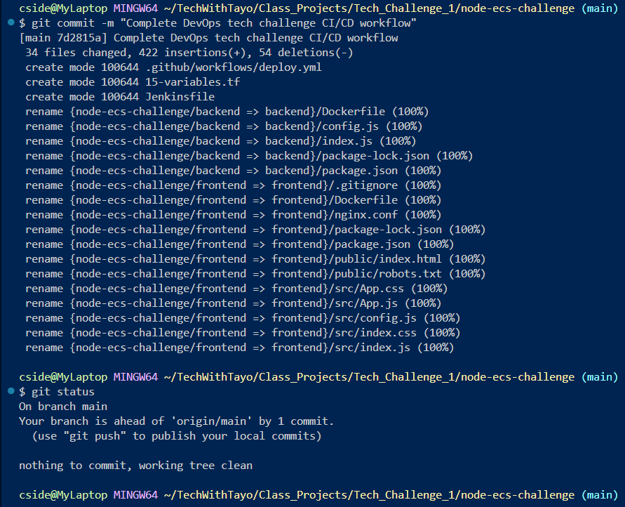 | 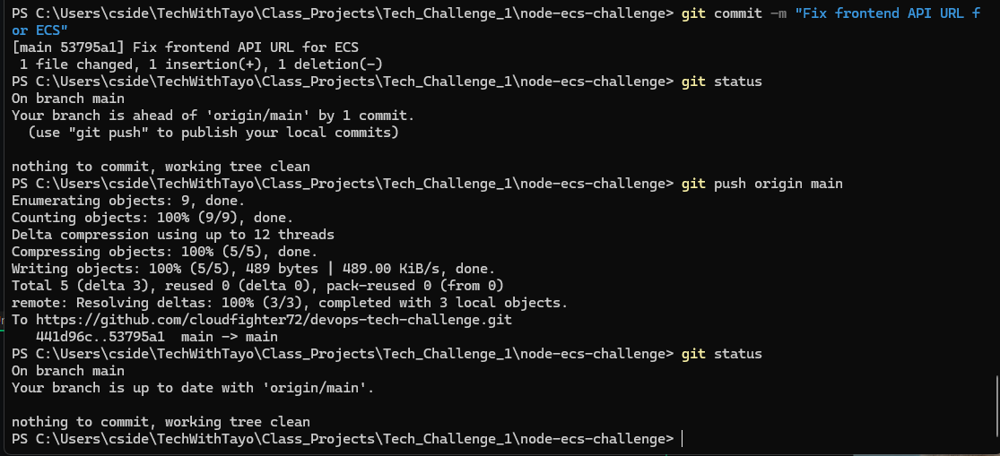 |
| Committing and pushing the completed Jenkins/Terraform CI/CD workflow                                  | Fixing the frontend API URL for ECS and pushing the change                                  |

|                                                                                                             |                                                                                                        |
| ----------------------------------------------------------------------------------------------------------- | ------------------------------------------------------------------------------------------------------ |
| 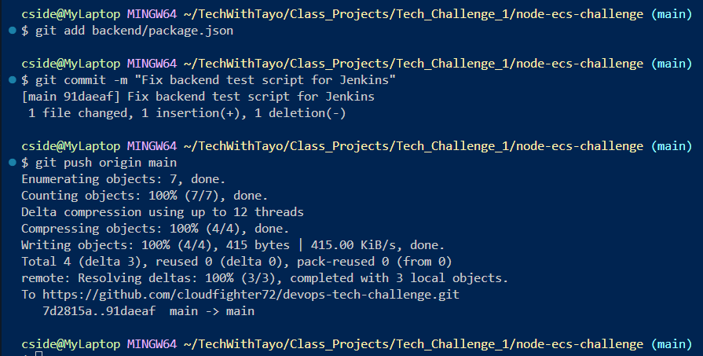 | 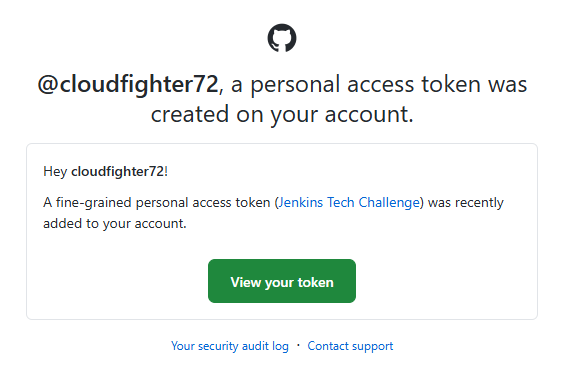 |
| Fixing the backend test script for Jenkins                                                                  | GitHub fine-grained personal access token created for Jenkins to authenticate to this repo             |

### Docker build & ECR push

|                                                                                             |                                                                                                              |
| ------------------------------------------------------------------------------------------- | ------------------------------------------------------------------------------------------------------------ |
| 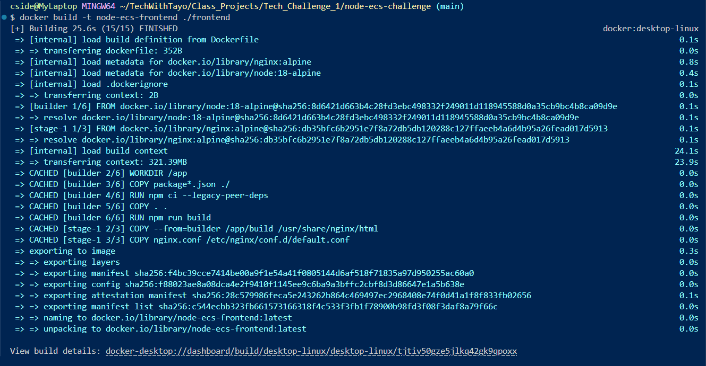 | 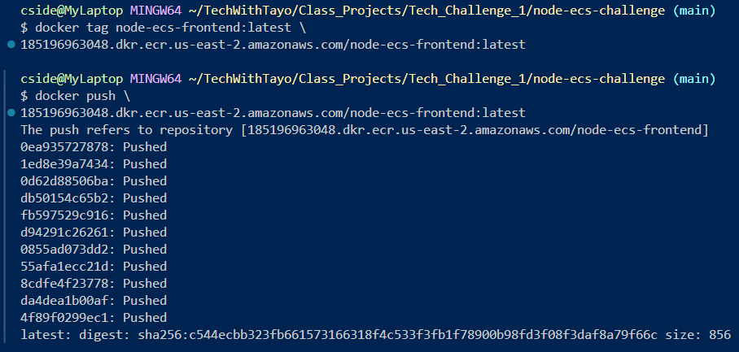 |
| Building the frontend image locally via Docker                                              | Tagging and pushing the frontend image to ECR                                                                |

|                                                                                           |                                                                                                            |
| ----------------------------------------------------------------------------------------- | ---------------------------------------------------------------------------------------------------------- |
| 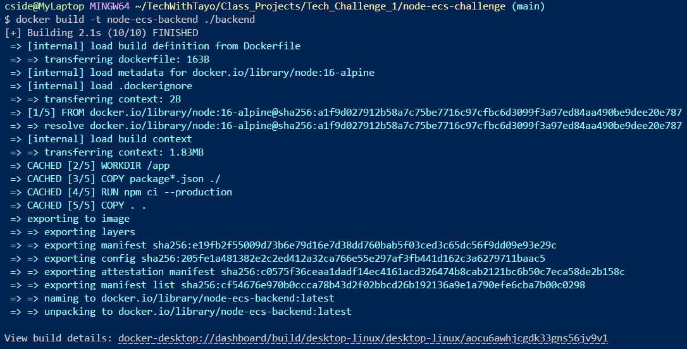 | 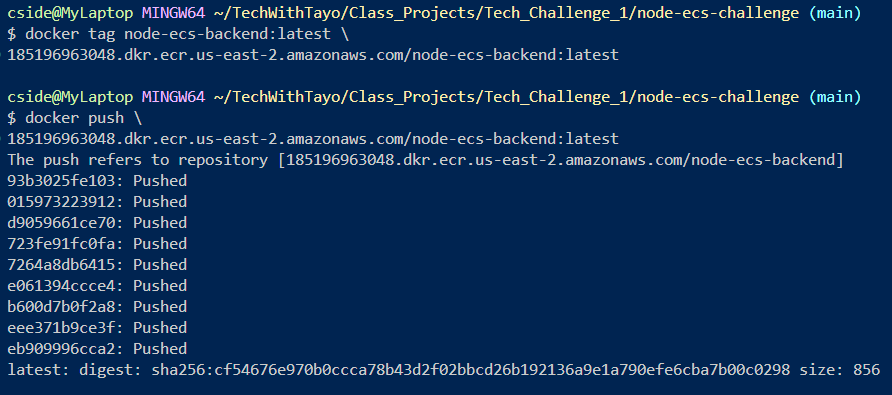 |
| Building the backend image locally via Docker                                             | Tagging and pushing the backend image to ECR                                                               |

|                                                                                             |                                                                                               |
| ------------------------------------------------------------------------------------------- | --------------------------------------------------------------------------------------------- |
| 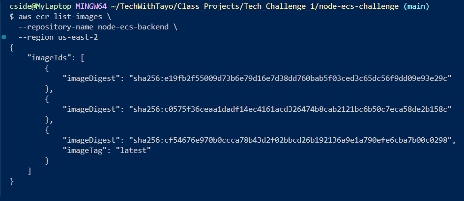 | 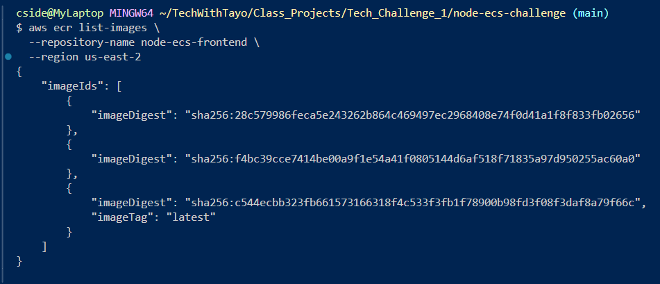 |
| Backend images listed in ECR (`node-ecs-backend`)                                           | Frontend images listed in ECR (`node-ecs-frontend`)                                           |

### Terraform apply & destroy

|                                                                                                                |                                                                                                                                                               |
| -------------------------------------------------------------------------------------------------------------- | ------------------------------------------------------------------------------------------------------------------------------------------------------------- |
| 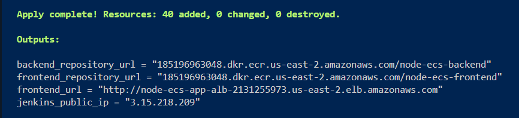                 | 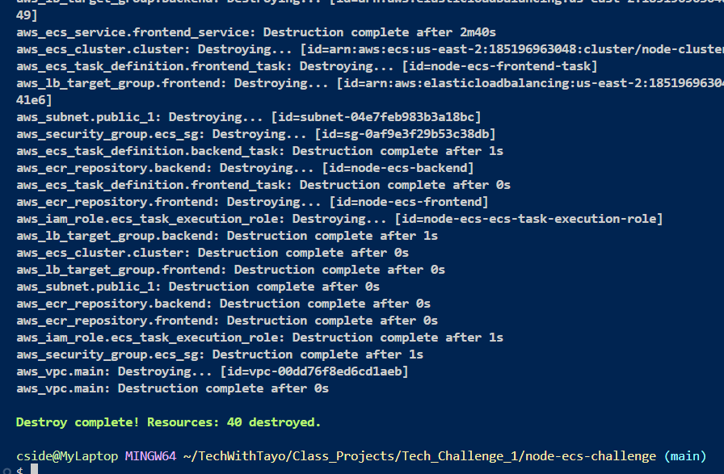                                               |
| `terraform apply` — 40 resources added, including ECR repo URLs, ALB DNS, and the Jenkins public IP as outputs | `terraform destroy` — full teardown of the VPC, ECS cluster, services, task definitions, IAM roles, and ECR repos, confirming everything is Terraform-managed |

### ECS deployment & health

|                                                                                                           |                                                                                                                                            |
| --------------------------------------------------------------------------------------------------------- | ------------------------------------------------------------------------------------------------------------------------------------------ |
| 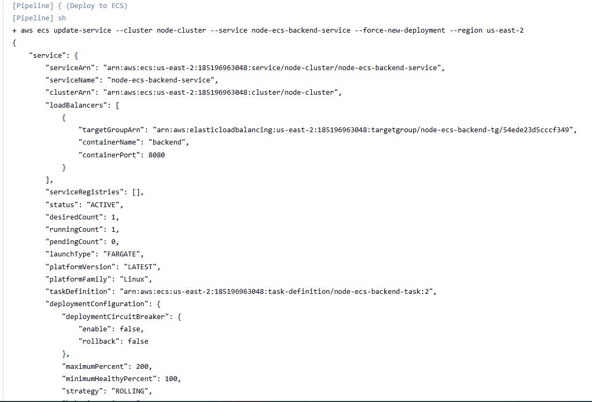 | 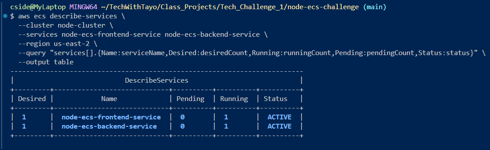                              |
| `aws ecs update-service --force-new-deployment` triggered from the Jenkinsfile                            | `aws ecs describe-services` confirming both `node-ecs-frontend-service` and `node-ecs-backend-service` are `ACTIVE` with 1/1 tasks running |

|                                                                                             |                                                                                               |
| ------------------------------------------------------------------------------------------- | --------------------------------------------------------------------------------------------- |
| 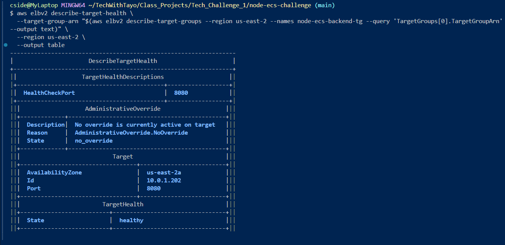 | 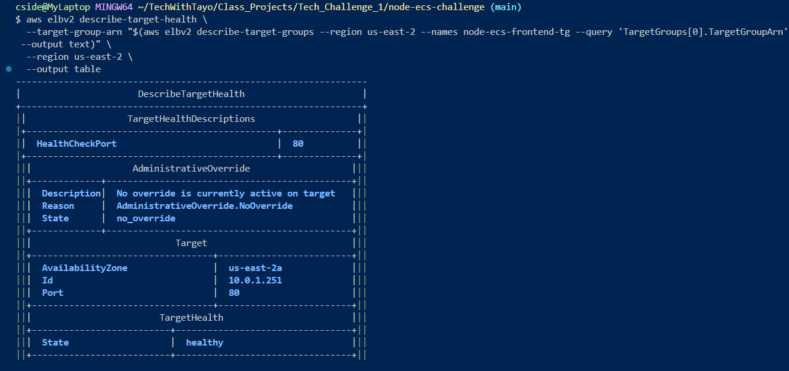 |
| Backend ALB target group — target healthy on port 8080                                      | Frontend ALB target group — target healthy on port 80                                         |

### Jenkins pipeline

|                                                                                             |                                                                                                                |
| ------------------------------------------------------------------------------------------- | -------------------------------------------------------------------------------------------------------------- |
|  | 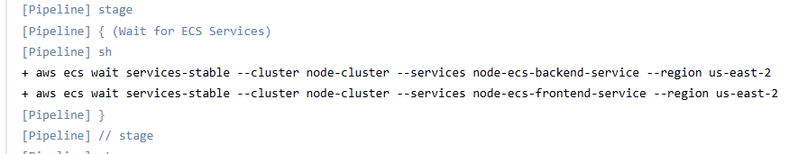 |
| Pipeline stage pushing the backend image to ECR                                             | Pipeline stage waiting for `node-ecs-backend-service` and `node-ecs-frontend-service` to reach a stable state  |

|                                                                                                          |                                                                                                                           |
| -------------------------------------------------------------------------------------------------------- | ------------------------------------------------------------------------------------------------------------------------- |
| 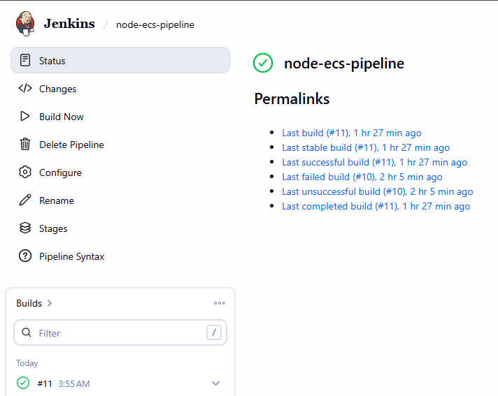 |  |
| `node-ecs-pipeline` build #11 — last successful build                                                    | Full pipeline log confirming both services deployed to ECS and the build finished with `SUCCESS`                          |

|                                                                                               |                                                                                                                                 |
| --------------------------------------------------------------------------------------------- | ------------------------------------------------------------------------------------------------------------------------------- |
| 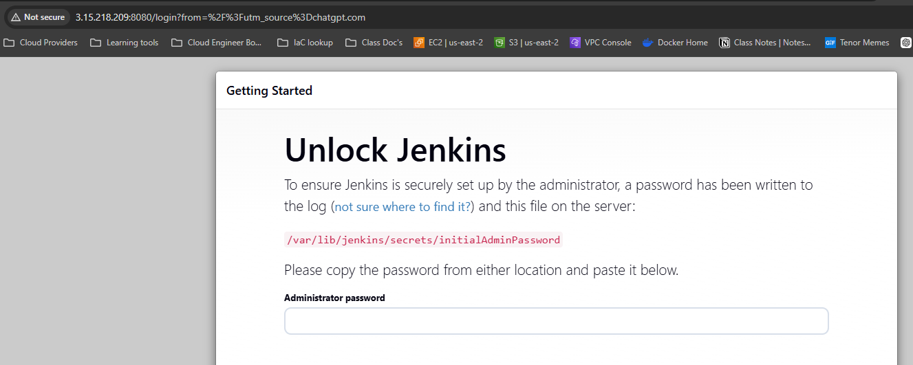 | 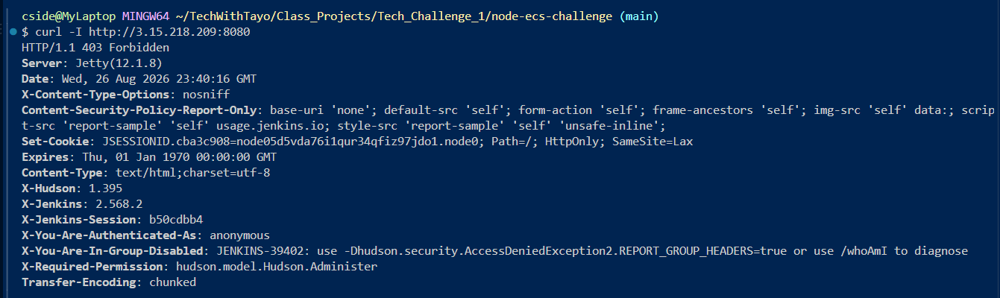                              |
| Jenkins UI reachable at `http://3.15.218.209:8080` — initial unlock screen                    | `curl -I` to Jenkins returning `403 Forbidden` for an unauthenticated request, confirming Jenkins is live and access-controlled |

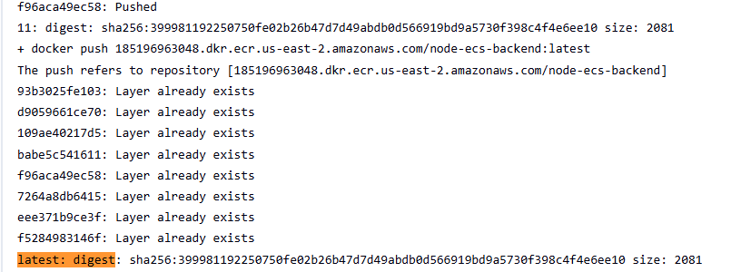
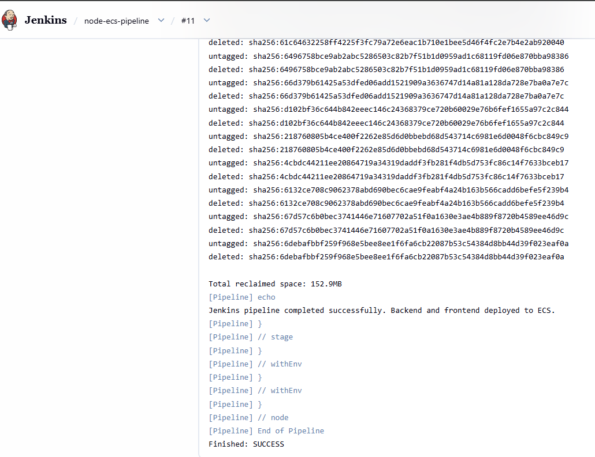

### Live verification

|                                                                                                     |                                                                                                         |
| --------------------------------------------------------------------------------------------------- | ------------------------------------------------------------------------------------------------------- |
| 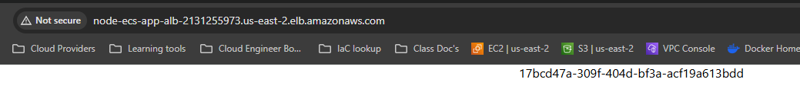 | 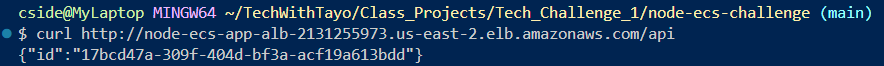 |
| Frontend served through the ALB, displaying a generated GUID on successful backend connection       | `curl` to the `/api` route through the ALB, returning the same GUID as JSON                             |

### Load test

|                                                                                                                        |                                                                                                                            |
| ---------------------------------------------------------------------------------------------------------------------- | -------------------------------------------------------------------------------------------------------------------------- |
| 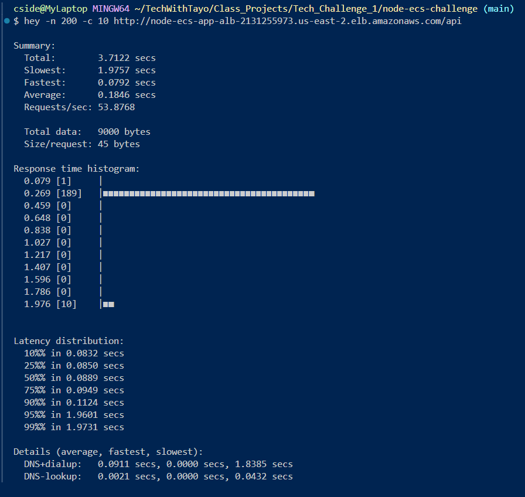 | 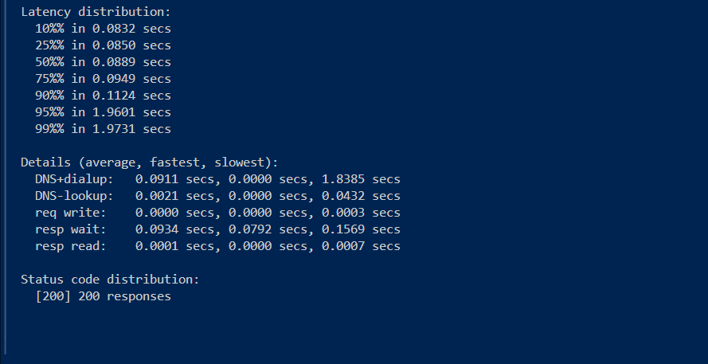 |
| Summary — 200 requests, 10 concurrent users, ~54 req/sec against the ALB `/api` endpoint                               | Latency distribution and status codes — all 200 requests returned `200 OK`                                                 |

---

## GitOps Alternative (GitHub Actions)

`.github/workflows/deploy.yml` implements an equivalent CI/CD flow using GitHub Actions instead of Jenkins:

- Builds Docker images for `frontend` and `backend`.
- Pushes images to ECR.
- Updates ECS task definitions and triggers service deployments via the AWS CLI / official ECS deploy action.

|                                                                                                                       |                                                                                                                                        |
| --------------------------------------------------------------------------------------------------------------------- | -------------------------------------------------------------------------------------------------------------------------------------- |
| 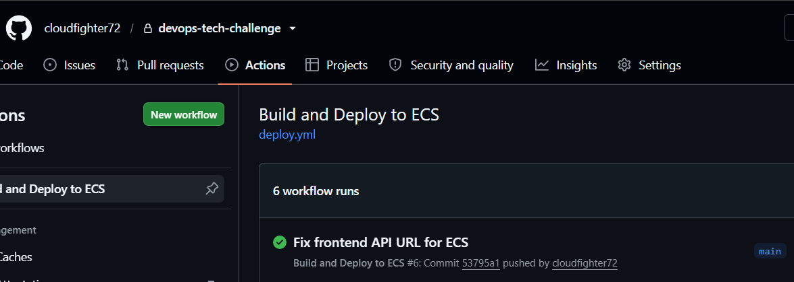 | 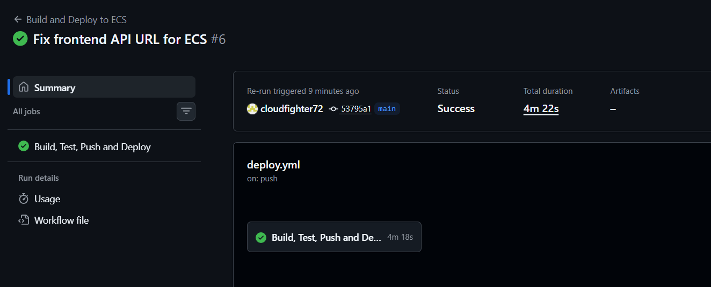 |
| `deploy.yml` workflow history — 6 runs, latest triggered by "Fix frontend API URL for ECS"                            | Run detail — the `Build, Test, Push and Deploy` job completing successfully in 4m 22s                                                  |

---

## Evaluation Checklist

- [x] Frontend and backend deployed to AWS ECS (Fargate) and publicly accessible
- [x] Jenkins server deployed and publicly accessible
- [x] Deployment automated via Jenkins pipeline
- [x] All application infrastructure (and the Jenkins host) provisioned via Terraform
- [x] GitOps alternative implemented via GitHub Actions
- [x] Private repository shared with `michaeltayo96@outlook.com` — confirm before submitting

---

## Notes / Known Limitations

`<Optional: call out any trade-offs, shortcuts, or things you'd improve with more time.>`
